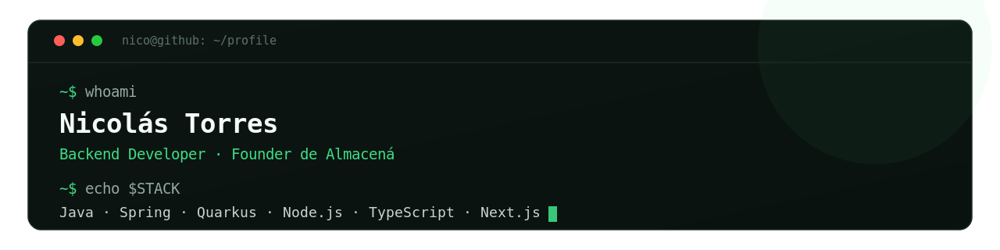

  

  

Desarrollador Backend (Java, Spring, Quarkus, Node.js) y fundador de **Almacená**, un SaaS de gestión y pagos para comercios que hoy usan 14 negocios en Argentina. Estudiante avanzado de Licenciatura en Sistemas de Información (UNSE, 5.º año). Me muevo cómodo en todo el ciclo: diseñar, asegurar y operar sistemas en producción. Inglés B2.

Buscando rol como **Backend** o **Full Stack Developer**.

---

## Proyectos destacados

### 🏪 Almacená — *SaaS en producción*

SaaS multi-tenant de gestión y pagos para comercios, usado a diario por 14 negocios para vender, cobrar y controlar su caja. Diseñé, aseguré y opero la plataforma end-to-end: módulo de pagos y cobranzas con múltiples medios (efectivo, débito, crédito, transferencia, Mercado Pago), cuenta corriente de clientes y proveedores, control de caja por turno, reportes de negocio, autenticación con tokens rotativos, RBAC granular y actualizaciones en tiempo real por WebSockets.

**Stack** · Node.js · Fastify · Prisma · PostgreSQL · Next.js · React · TypeScript · WebSockets · Mercado Pago · Docker

---

### 🏥 Obra Social Almedin

Sistema de gestión para una obra social médica — backend REST + SPA con tres portales diferenciados por rol. Permite gestionar turnos médicos, horarios de especialistas, penalidades por ausencia y notificaciones en tiempo real vía SSE.

**Backend** · Quarkus 3 · Java 17 · PostgreSQL · Arquitectura hexagonal · JWT RS256 · SSE · 77% de cobertura · CI/CD en GitHub Actions · Deploy en Render

**Frontend** · React 18 · TypeScript · Vite · Zustand · TanStack Query · Sistema de diseño propio · Dark/light mode · Deploy en Vercel

---

### 📱 SDE-Conecta *(colaboración)*

App móvil desarrollada en equipo de 3 personas para conectar estudiantes con servicios universitarios. Trabajo colaborativo con Git, múltiples branches y revisión de código entre pares.

**React Native** · **Expo** · **JavaScript** · **Firebase**

---

## Stack

**Backend**

**Frontend**

**Herramientas**

---

## GitHub

  
  

  <picture>
    <source media="(prefers-color-scheme: dark)" srcset="https://raw.githubusercontent.com/nicolasjitorres/nicolasjitorres/output/github-contribution-grid-snake-dark.svg" />
    
  </picture>

---

## Contacto

